# Radionica - _Space Shooter_ igrica u Godot-u __(WORK IN PROGRESS)__

## Preuzimanje Godot-a

_Godot_ možemo preuzeti sa zvaničnog sajta [godotengine.org](https://godotengine.org/). Program zauzima svega nekoliko desetina megabajta.

## Kreiranje projekta

Nakon pokretanja aplikacije dobićemo prozor sa listom projekata koje imamo (za sada ih nemamo) i opciju da kreiramo novi projekat. Svaki projekat predstavlja jendu igricu ili aplikaciju, tako da ćemo kreirati jedan projekat za našu _Space Shooter_ igricu:

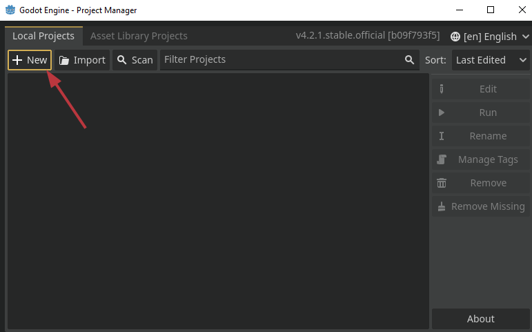

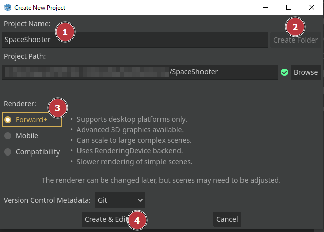

## Kreiranje prve scene

U _Godot_-u svaki vidljivi element ili element koji nosi neku funkcionalnost predstavljamo preko _Node_-a, tj. čvora. Ono što će ultimativno u igrici postojati kada je pokrenemo je gomila _Node_-ova povezanih u stablo, i svaki od njih doprinosi na neki svoj način. U kontekstu objektno-orjentisanog programiranja _Node_ je ekvivalent objektu, a _Godot_-u postoje ugrađene klase čije su instance različiti _Node_-ovi.

Jedan od načina da opišemo koje _Node_-ove želimo da imamo u igri i na koj način će oni međusobno biti povezani je da kreiramo takozvanu "scenu" (en. _Scene_). Scena je tekstualni fajl koga smeštamo među fajlove projekta napisan u sintaksi koja opisuje koji objekti (_Node_-ovi) će se instancirati u igri, kako će biti povezani u okviru stabla, koje vrednosti različitih svojstava će im se postaviti, itd.

Evo jednog primera fajla scene:

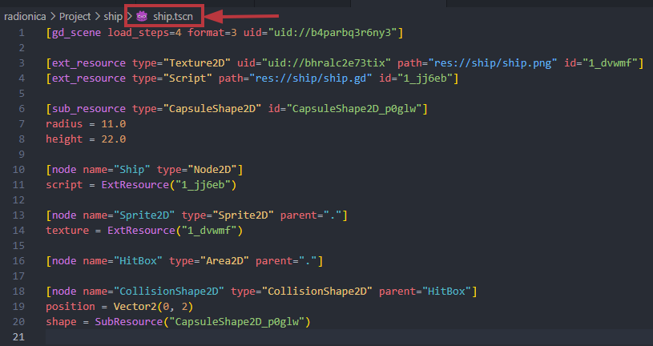

Našu igru ćemo predstaviti jednom scenom. Možemo je kreirati na sledeći način:

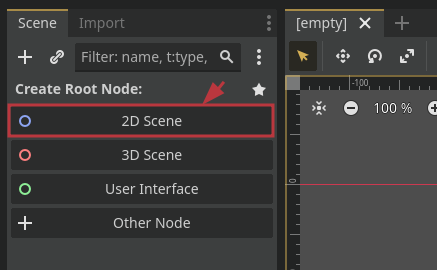

Sa leve strane, u tabu _Scene_ možemo videti grafiku reprezentaciju strukture stbla koje _Node_-ovi (objekti) sačinjavaju a koja je opisa na u scene fajlu. Međutim, taj fajl još uvek ne postoji u našem projektu, to možemo videti u tabu same scene:

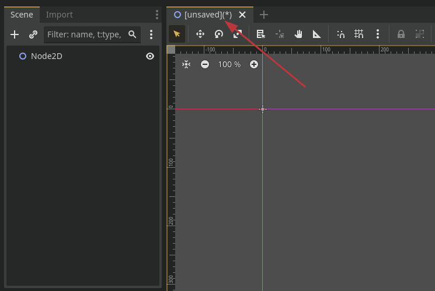

Zato ćemo sačuvati scenu, skraćenica `ctrl+s`:

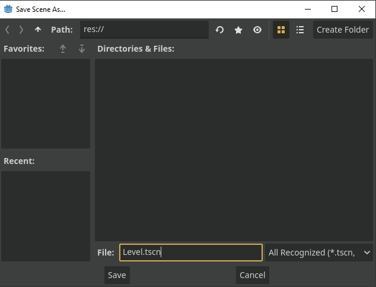

Sada je scena sačuvana kao `level.tscn` fajl.

## Dodvanje Node-ova

Svak scena mora imati samo jedan _root_ _Node_, što naša nova scena i ima. Scenu smo nazvali _level_, i njenim instanciranjem želimo da dobijemo jedan _Node_, koga će sam _engine_ uzeti da koristi prilikom pokretanja igrice, ali želimo i da sadrži sve ostale elemente igrice, naravno predstavljene preko ugnježdenih _Node_-ova.

Evo primera kako da dodamo novi _Node_ u okviru ove scene (kao _child_ _Node_ od _root_ _Node_-a u ovoj sceni). Kreiraćemo _Node_ kome možemo dodeliti fajl nekom slikom kako bi mogao da bude vidljiv grafički u sceni:

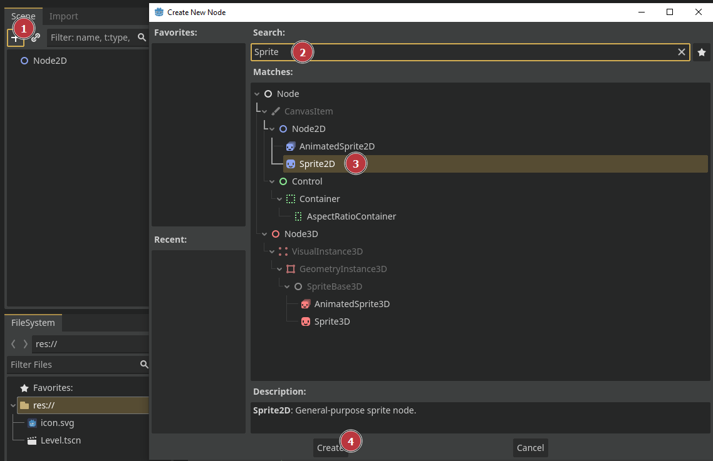

U scenu smo dodali informacije o kreiranju _Node_-a (objekat) tipa _Sprite2D_ (klasa). Sa desne strane se nalazi panel _Inspector_ koji prikazuje osobine koje će izabrani _Node_ imati kada bude bio instanciran.

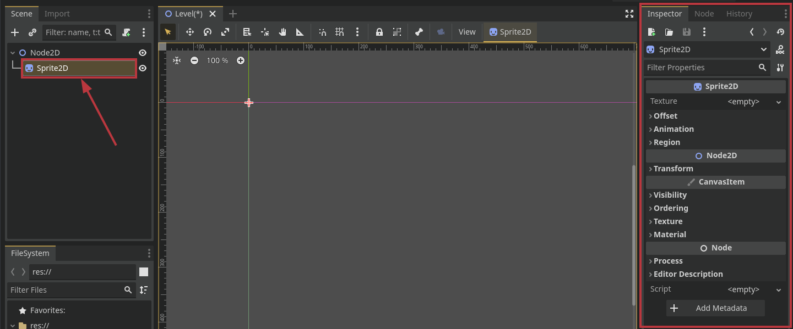

U fajlovima projekta se nalazi _Godot_ ikonica (`icon.svg`) koju možemo iskoristiti kao sliku _Node_-a. Postavićemo _texture_ svojstvo _Node_-a na putanju do fajla slike:

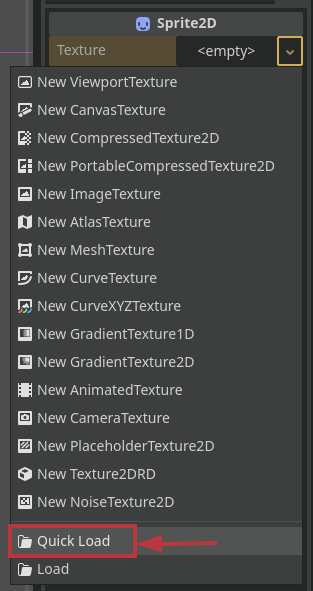

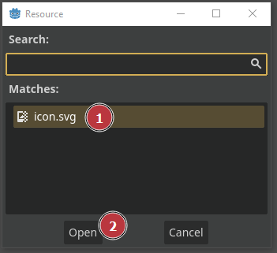

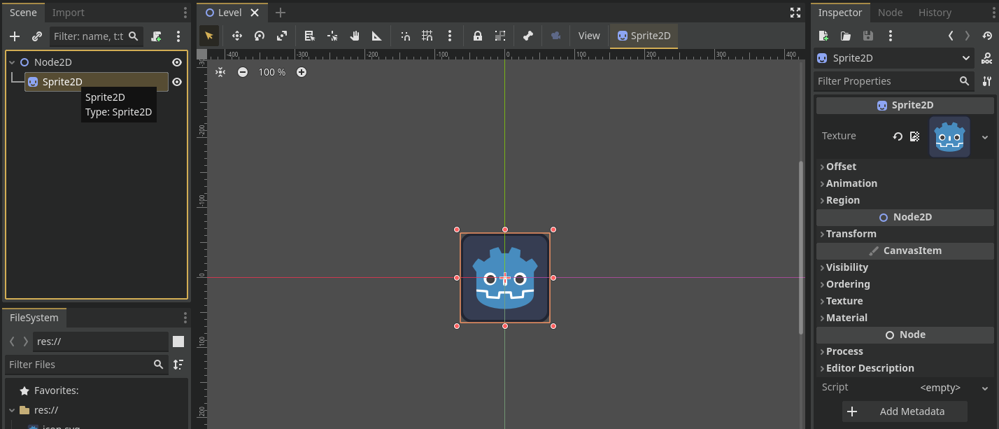

Sada, kada smo povezali _Node_ i sliku, ona je vidljiva na sceni na lokaciji tog _Node_-a. Po ovom principu funkcionišu i ostali tipovi _Node_-ova i njihova svojstva.

Možemo krenuti sa radom na ostalim delovima igrice.

## Struktura projekta

Projekat ćemo organizovati tako da se sastoji iz 4 scene, gde svaka opisuje kako će se kreirati _Node_ (zajedno sa svojim stablom _child_ _Node_-ova) za svaki od galvnim elemenata igrice. Ti elementi su:
* _Level_ - Instancira se prilikom pokretanja igrice. U njemu se instanciraju sve ostale scene.
* _Ship_ - Reaguje na input igrača, može da se kreće horizontalno i da ispaljuje rakete.
* _Rocket_ - Kada se instancira kreće se vertikalno na gore. Prilikom udara u asteroid uništava se i igrač dobija poen.
* _Asteroid_ - Kada se instancira kreće se vertikalno na dole. Prilikom udara brod ili raketu uništava se.

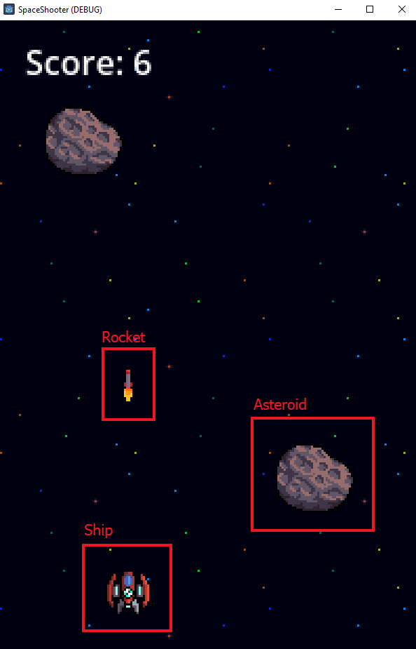

U nastavku ćemo realizovati sve elemente igrice.

## Ship

Brod će biti predstavljen jednim čvorom tipa _Node2D_ sa svojim _child_ čvorovima koji će obezbediti potrebne funkcionalnosti. Prvo ćemo kreirati novu scenu koja će predstavljati recept za kreiranje broda:

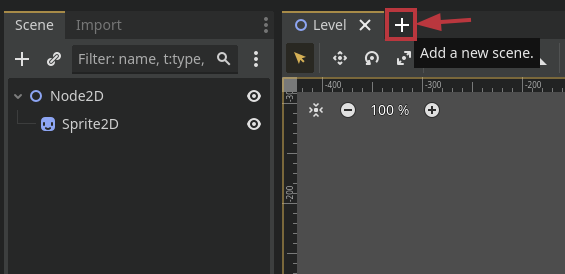

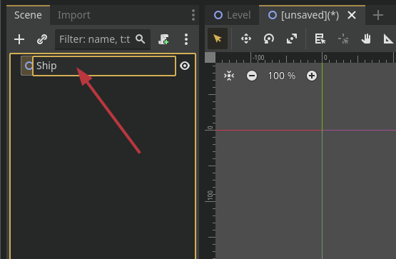

Zatim, kako bismo se bolje snašli unutar strukture fajlova projekta kreiraćemo novi folder sa svaki od glavnih elemenata igrice. Sada kreiramo folder `ship`:

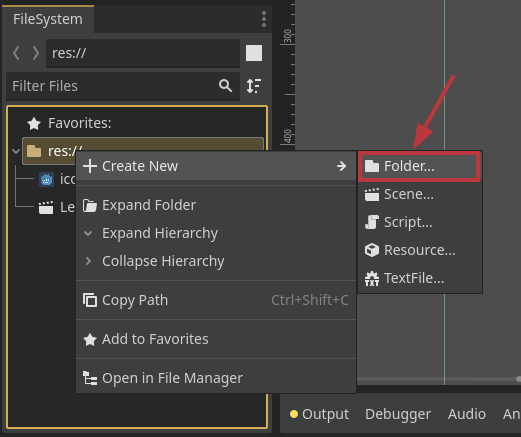

Zatim scenu broda možemo sačuvati u tom folderu:

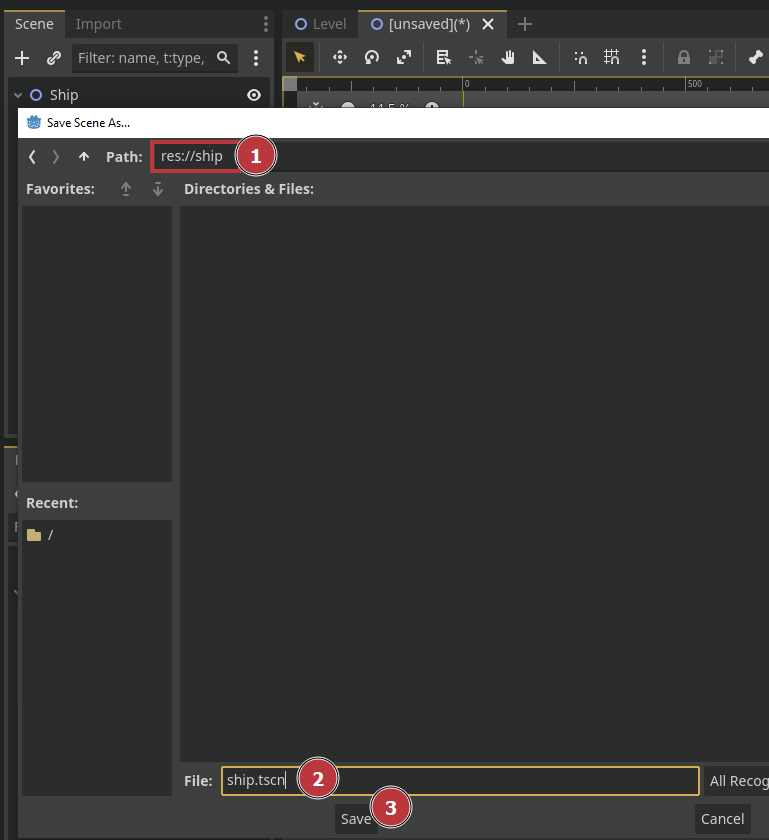

Kao što smo u primeru sa početka sceni _level_ dodali čvor sa slikom, tako ćemo i sceni _ship_ dodati _child_ _Node_ tipa _Sprite2D_ kako bismo prikazali brod. Ali prvo da u fajlove projekta dodamo sliku broda koju ćemo koristiti:

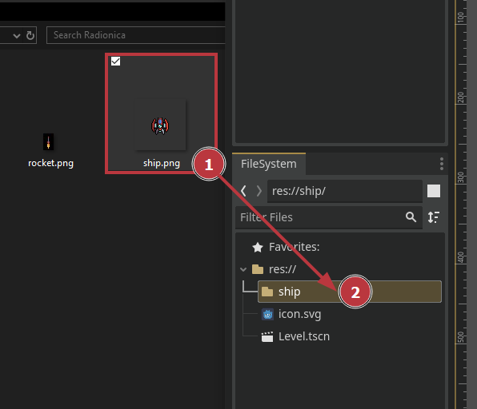

Sada na isti način kako smo u sceni _level_ povezali sliku ikonice i _Sprite2D_ čvor, tako ćemo uraditi i ovde sa slikom `ship.png`. Nakon toga ćemo moći da vidimo brod u _ship_ sceni, ali ćemo primetiti i dva problema koja ćemo pokušati da rešimo.

Prvo možemo primetiti da je brod dosta sitan u odnosu na podrazumevanu veličinu prozora igrice:

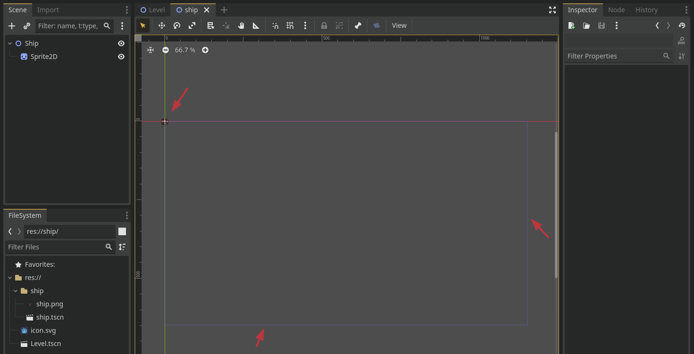

Drugi problem je to što zbog male rezolucije slike (jer je igrica u _pixel art_ stilu, svaki pixel je od značaja) ona izgleda zamućeno:

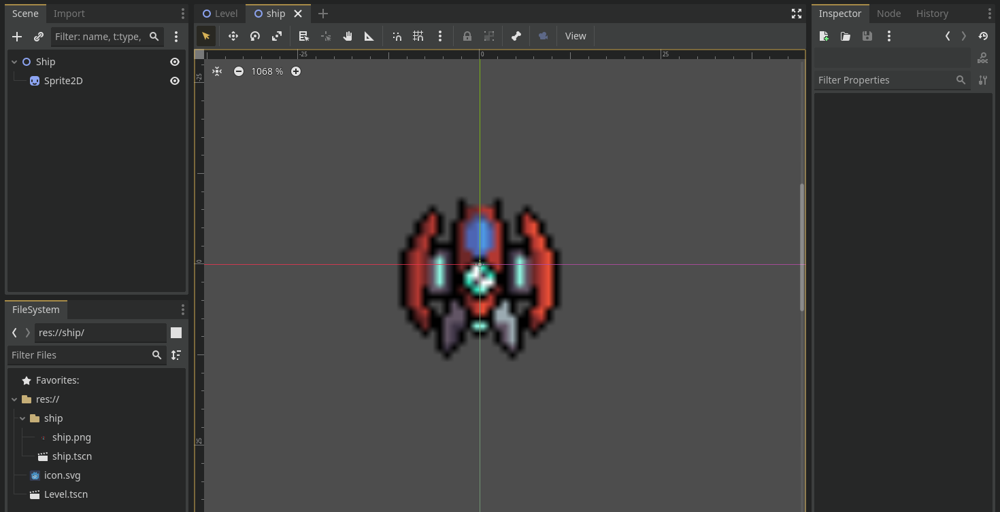

Oba problema nastaju zbog podrazumevanih podešavanja projekta koja odgovaraju za većinu novih projekata, ali u našem slučaju ih valja promeniti.

### Project Settings

Kako bismo menjali podešavanja projekta otvorićemo prozor za to:

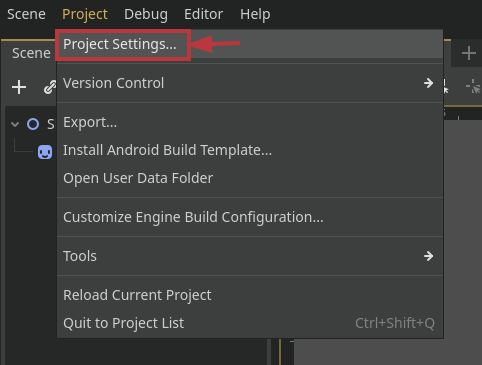

Prvo ćemo podesiti veličinu prozora igrice. Date vrednosti su izražene u pixelima, a mi ćemo ih vrednosti na sledeće vrednosti:

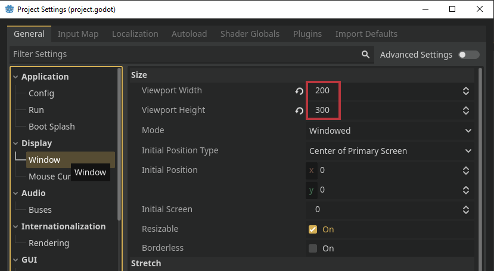

Ovako malu rezoluciju postavljamo kako bi igrica bila iscrtana u rezoluciji koja odgovara slikama igre, jer su i one u maloj rezoluciji, i želimo da se prilikom igranja vidi svaki pixel. 

Ali kako ne bi i sam prozor bio mali podesićemo da se przor raširi na veličinu celobrojnog umnoška ove male rezolucije i da zadrži proporcije visine i širine prozora:

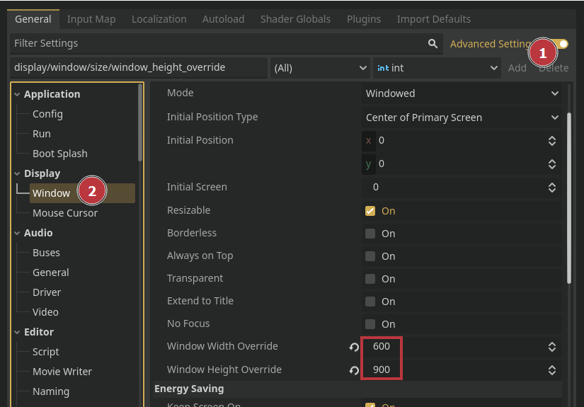

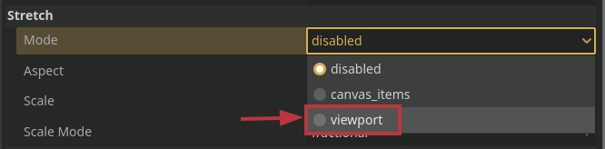

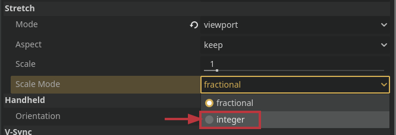

Ovime smo rešili pitanje veličine ekrana i rezolucije. Ostalo nam je još da popravimo zamućenje slike. To ćemo uraditi tako što promenimo tip filtriranja teksutra:

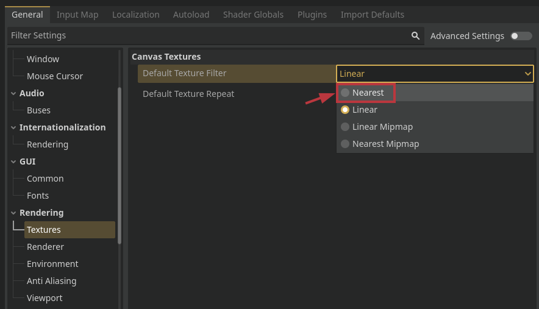

Takođe ćemo podesiti da se pozicija _Node_-ova u toku kretanja i mirovanja uvek prilagodi tako da se pixeli slika uvek poklope sa pixelima ekrana, kako bismo dobili najpreciznije iscrtavanje:

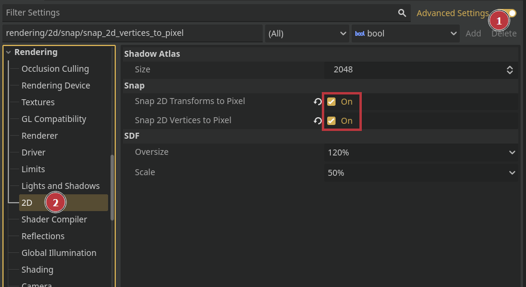

## Pokretanje projekta

Nakon što smo promenili podešavanja možemo videti da se brod iscrtava bez ikakvih nepravilnosti. Vreme je da pokrenemo igricu i vidimo kako trenutno izglda.

Prvo ćemo u sceni _level_ dodati scenu _ship_ kao _Node_ koji treba biti instanciran:

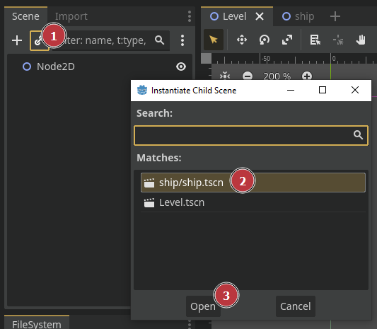

Kada kliknemo na dugme _Play_ u gornjem desnom uglu (shortcut `F5`) prvo ćemo dobiti pitanje okju scenu _engine_ treba da koristi prilikom pokretanja igrice. Pošto je trenutno otvorena _level_ scena možemo izabrati _Select Current_. U podešavanjima projekta se ova podrazumevana scena može promeniti takođe.

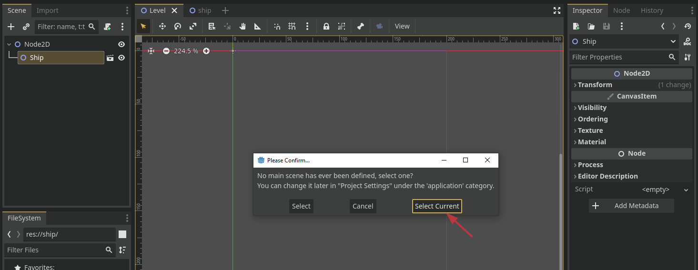

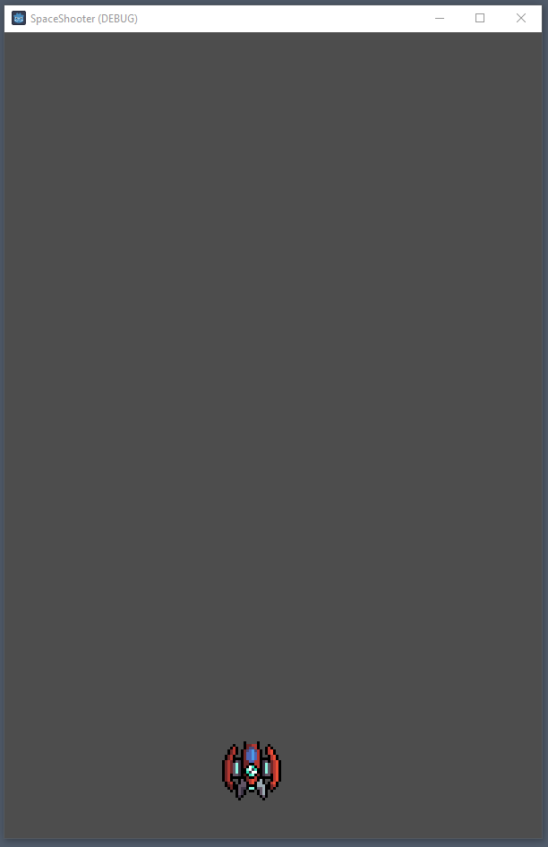

## Kreiranje preostalih scena

Na isti način kao što smo kreirali _ship_ scenu kreiraćemo _rocket_ i _asteroid_ scene, sa istom strukturom _Node_-ova, root je _Node2D_ sa jednim _child_ čvorom _Sprite2D_ kome se postavlja odgovarajuća slika. Takođe ćemo sliku i scenu za raketu i asteroid čuvati u istoimenim folderima, kao za brod.

Na kraju, kako bismo stekli utisak kako će igrica izgledati u _level_ možemo postaviti ove scene:


## Skripte - Proširivanje Node-ova

Skripta je fajl sa programskim kodom koji dodaje svojstva i funkcije čvorovima za koje je zakačena. U _Godot_-u možemo pisati kod u programskim jezicima _C#_ i _GDScript_. Mi ćemo koristiti GDScript, kako je to primarni način za pisanje skripti, sa najviše podrške, a i za nas trenutno najjednostavniji.

Za svaki od glavnih elemenata (_Level_, _Ship_, _Rocket_, _Asteroid_) kreiraćemo po jednu skriptu koja će proširiti njihovo ponašanje.

### Asteroid skripta

U _asteroid_ sceni na sledeći način možemo kreirati skriptu:

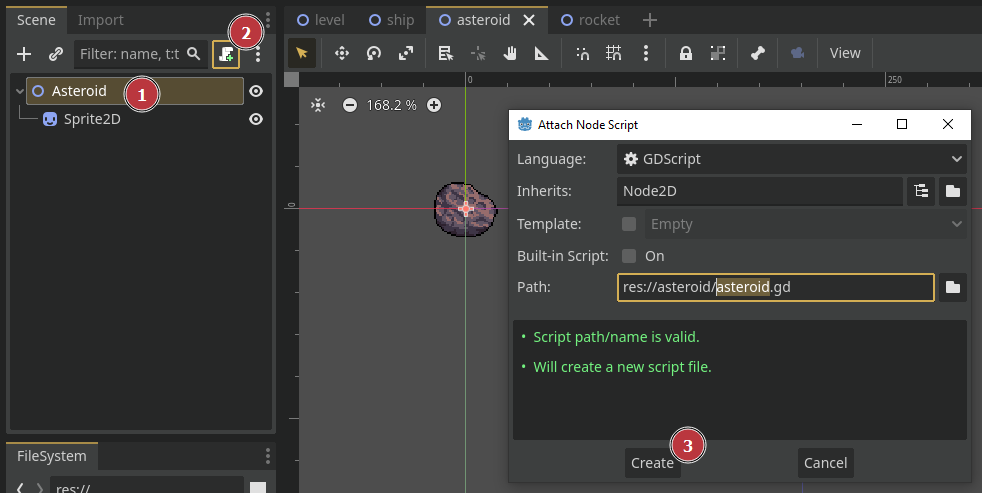

Sačuvali smo je u _asteroid_ folderu. Sada u ovom fajlu možemo napisati osnovno ponašanje asteroida u okviru _Script_ editora.

```gdscript
class_name Asteroid
extends Node2D

signal point_gained

var speed = 100 # brzina kretanja

# funkcija koja se izvrsava ponovo za svaki frame
# delta je proteklo vreme u sekundama od prethodnog frame-a
func _process(delta):
	# pomeraj po Y osi koji zavisi od brzine i delta-e
	var direction = Vector2(0, 1)
	translate(direction * speed * delta)

func destroy():
	queue_free() # iniciranje brisanja ovog objekta

## Upravljanje brodom

Na isti način kako smo kreirali skriptu za asteroid kreiraćemo i skriptu za brod. Nazvaćemo je `ship.gd`, smestiti u `ship` folder i zakačiti na _root_ čvor broda u sceni _ship_. Sledeći kod će nam omogućiti kontrolu broda:

```gdscript
class_name Ship
extends Node2D

# učitaćemo informacije iz scene kao objekat, i kasnije ga možemo pretvoriti u Node i instancirati
var rocket_scene = preload("res://rocket/rocket.tscn")
var speed = 150

# funkcija vraća smer kretanja po x osi u zavisnosti od inputa igrača
# ukoliko su pritisnuti dugmići i za levo i za desno kretanje će se anulirati
func calc_direction():
	var dir = Vector2.ZERO
	dir.x += 1 if Input.is_action_pressed("ui_right") else 0
	dir.x += -1 if Input.is_action_pressed("ui_left") else 0
	return dir

func fire():
	# od objekta koji predstavlja rocket scenu kreiramo stablo čvorova ...
	# ... sa root čvorom kao nosiocem cele te strukture
	# u promenljivoj rocket čuvamo referencu na novokreirani root čvor tog stabla
	var rocket = rocket_scene.instantiate()
	rocket.position = position + Vector2(0, -20) # postavljamo početnu poziciju rakete malo iznad broda
	add_sibling(rocket)	# dodajemo raketu u igru, tj. u stablo gde se nalazi i brod tako da imaju isti parent čvor

func _process(delta):
	var direction = calc_direction() # dobijamo smer kretanja u zavisnosti od inputa igrača
	translate(direction * speed * delta) # pomeramo brod u željenom smeru
	
# ova ugrađena funkcija se poziva svaki put kada igrač pritisne bilo koje dugme
func _unhandled_input(event):
	if event.is_action_pressed("ui_accept"): # ukoliko je pritisnuto dugme zapravo space ili enter ...
		fire()	# ... ispaljujemo raketu

```

## Kolizije

