# Radionica - _Space Shooter_ igrica u Godot-u

Za praćenje radionice potrebno je osnovno poznavanje koncepata objektno-orjentisanog programiranja.

## Preuzimanje Godot-a

_Godot_ možemo preuzeti sa zvaničnog sajta [godotengine.org](https://godotengine.org/). Program zauzima svega nekoliko desetina megabajta.

## Kreiranje projekta

Nakon pokretanja aplikacije dobićemo prozor sa listom projekata koje imamo (za sada ih nemamo) i opciju da kreiramo novi projekat. Svaki projekat predstavlja jendu igricu ili aplikaciju, tako da ćemo kreirati jedan projekat za našu _Space Shooter_ igricu:


## Kreiranje prve scene

U _Godot_-u svaki vidljivi element ili element koji nosi neku funkcionalnost predstavljamo preko _Node_-a, tj. čvora. Ono što će ultimativno u igrici postojati kada je pokrenemo je gomila _Node_-ova povezanih u stablo, i svaki od njih doprinosi na neki svoj način. U kontekstu objektno-orjentisanog programiranja _Node_ je ekvivalent objektu, a _Godot_-u postoje ugrađene klase čije su instance različiti _Node_-ovi.

Jedan od načina da opišemo koje _Node_-ove želimo da imamo u igri i na koj način će oni međusobno biti povezani je da kreiramo takozvanu "scenu" (en. _Scene_). Scena je tekstualni fajl koga smeštamo među fajlove projekta napisan u sintaksi koja opisuje koji objekti (_Node_-ovi) će se instancirati u igri, kako će biti povezani u okviru stabla, koje vrednosti različitih svojstava će im se postaviti, itd.

Evo jednog primera fajla scene:


Našu igru ćemo predstaviti jednom scenom. Možemo je kreirati na sledeći način:


Sa leve strane, u tabu _Scene_ možemo videti grafiku reprezentaciju strukture stbla koje _Node_-ovi (objekti) sačinjavaju a koja je opisa na u scene fajlu. Međutim, taj fajl još uvek ne postoji u našem projektu, to možemo videti u tabu same scene:


Zato ćemo sačuvati scenu, skraćenica `ctrl+s`:


Sada je scena sačuvana kao `level.tscn` fajl.

## Dodvanje Node-ova

Svak scena mora imati samo jedan _root_ _Node_, što naša nova scena i ima. Scenu smo nazvali _level_, i njenim instanciranjem želimo da dobijemo jedan _Node_, koga će sam _engine_ uzeti da koristi prilikom pokretanja igrice, ali želimo i da sadrži sve ostale elemente igrice, naravno predstavljene preko ugnježdenih _Node_-ova.

Evo primera kako da dodamo novi _Node_ u okviru ove scene (kao _child_ _Node_ od _root_ _Node_-a u ovoj sceni). Kreiraćemo _Node_ kome možemo dodeliti fajl nekom slikom kako bi mogao da bude vidljiv grafički u sceni:


U scenu smo dodali informacije o kreiranju _Node_-a (objekat) tipa _Sprite2D_ (klasa). Sa desne strane se nalazi panel _Inspector_ koji prikazuje osobine koje će izabrani _Node_ imati kada bude bio instanciran.


U fajlovima projekta se nalazi _Godot_ ikonica (`icon.svg`) koju možemo iskoristiti kao sliku _Node_-a. Postavićemo _texture_ svojstvo _Node_-a na putanju do fajla slike:


Sada, kada smo povezali _Node_ i sliku, ona je vidljiva na sceni na lokaciji tog _Node_-a. Po ovom principu funkcionišu i ostali tipovi _Node_-ova i njihova svojstva.

Možemo krenuti sa radom na ostalim delovima igrice.

## Struktura projekta

Projekat ćemo organizovati tako da se sastoji iz 4 scene, gde svaka opisuje kako će se kreirati _Node_ (zajedno sa svojim stablom _child_ _Node_-ova) za svaki od galvnim elemenata igrice. Ti elementi su:
* _Level_ - Instancira se prilikom pokretanja igrice. U njemu se instanciraju sve ostale scene.
* _Ship_ - Reaguje na input igrača, može da se kreće horizontalno i da ispaljuje rakete.
* _Rocket_ - Kada se instancira kreće se vertikalno na gore. Prilikom udara u asteroid uništava se i igrač dobija poen.
* _Asteroid_ - Kada se instancira kreće se vertikalno na dole. Prilikom udara brod ili raketu uništava se.


U nastavku ćemo realizovati sve elemente igrice.

## Ship

Brod će biti predstavljen jednim čvorom tipa _Node2D_ sa svojim _child_ čvorovima koji će obezbediti potrebne funkcionalnosti. Prvo ćemo kreirati novu scenu koja će predstavljati recept za kreiranje broda:


Zatim, kako bismo se bolje snašli unutar strukture fajlova projekta kreiraćemo novi folder sa svaki od glavnih elemenata igrice. Sada kreiramo folder `ship`:


Zatim scenu broda možemo sačuvati u tom folderu:


Kao što smo u primeru sa početka sceni _level_ dodali čvor sa slikom, tako ćemo i sceni _ship_ dodati _child_ _Node_ tipa _Sprite2D_ kako bismo prikazali brod. Ali prvo da u fajlove projekta dodamo sliku broda koju ćemo koristiti:


Sada na isti način kako smo u sceni _level_ povezali sliku ikonice i _Sprite2D_ čvor, tako ćemo uraditi i ovde sa slikom `ship.png`. Nakon toga ćemo moći da vidimo brod u _ship_ sceni, ali ćemo primetiti i dva problema koja ćemo pokušati da rešimo.

Prvo možemo primetiti da je brod dosta sitan u odnosu na podrazumevanu veličinu prozora igrice:


Drugi problem je to što zbog male rezolucije slike (jer je igrica u _pixel art_ stilu, svaki pixel je od značaja) ona izgleda zamućeno:


Oba problema nastaju zbog podrazumevanih podešavanja projekta koja odgovaraju za većinu novih projekata, ali u našem slučaju ih valja promeniti.

### Project Settings

Kako bismo menjali podešavanja projekta otvorićemo prozor za to:


Prvo ćemo podesiti veličinu prozora igrice. Date vrednosti su izražene u pixelima, a mi ćemo ih vrednosti na sledeće vrednosti:


Ovako malu rezoluciju postavljamo kako bi igrica bila iscrtana u rezoluciji koja odgovara slikama igre, jer su i one u maloj rezoluciji, i želimo da se prilikom igranja vidi svaki pixel. 

Ali kako ne bi i sam prozor bio mali podesićemo da se przor raširi na veličinu celobrojnog umnoška ove male rezolucije i da zadrži proporcije visine i širine prozora:


Ovime smo rešili pitanje veličine ekrana i rezolucije. Ostalo nam je još da popravimo zamućenje slike. To ćemo uraditi tako što promenimo tip filtriranja teksutra:


Takođe ćemo podesiti da se pozicija _Node_-ova u toku kretanja i mirovanja uvek prilagodi tako da se pixeli slika uvek poklope sa pixelima ekrana, kako bismo dobili najpreciznije iscrtavanje:


## Pokretanje projekta

Nakon što smo promenili podešavanja možemo videti da se brod iscrtava bez ikakvih nepravilnosti. Vreme je da pokrenemo igricu i vidimo kako trenutno izglda.

Prvo ćemo u sceni _level_ dodati scenu _ship_ kao _Node_ koji treba biti instanciran:


Kada kliknemo na dugme _Play_ u gornjem desnom uglu (shortcut `F5`) prvo ćemo dobiti pitanje okju scenu _engine_ treba da koristi prilikom pokretanja igrice. Pošto je trenutno otvorena _level_ scena možemo izabrati _Select Current_. U podešavanjima projekta se ova podrazumevana scena može promeniti takođe.


## Kreiranje preostalih scena

Na isti način kao što smo kreirali _ship_ scenu kreiraćemo _rocket_ i _asteroid_ scene, sa istom strukturom _Node_-ova, root je _Node2D_ sa jednim _child_ čvorom _Sprite2D_ kome se postavlja odgovarajuća slika. Takođe ćemo sliku i scenu za raketu i asteroid čuvati u istoimenim folderima, kao za brod.

Na kraju, kako bismo stekli utisak kako će igrica izgledati u _level_ možemo postaviti ove scene:


## Skripte - Proširivanje Node-ova

Skripta je fajl sa programskim kodom koji dodaje svojstva i funkcije čvorovima za koje je zakačena. U _Godot_-u možemo pisati kod u programskim jezicima _C#_ i _GDScript_. Mi ćemo koristiti GDScript, kako je to primarni način za pisanje skripti, sa najviše podrške, a i za nas trenutno najjednostavniji.

Za svaki od glavnih elemenata (_Level_, _Ship_, _Rocket_, _Asteroid_) kreiraćemo po jednu skriptu koja će proširiti njihovo ponašanje.

### Asteroid skripta

Počećemo od skripte za _asteroid_. U sceni asteroida na sledeći način možemo kreirati skriptu i zakačiti je na njen _root_ čvor:


Sačuvali smo je u _asteroid_ folderu. Sada u ovom fajlu možemo napisati osnovno ponašanje asteroida u okviru _Script_ editora.

```gdscript
class_name Asteroid
extends Node2D

var speed = 100 # brzina kretanja

# funkcija koja se izvrsava ponovo za svaki frame
# delta je proteklo vreme u sekundama od prethodnog frame-a
func _process(delta):
	# pomeraj po Y osi koji zavisi od brzine i delta-e
	var direction = Vector2(0, 1)
	translate(direction * speed * delta)
```

Asteroid će se kretati po Y osi prema dnu prozora.

Kada _Node_ asteroida prestane da bude vidljiv na ekranu treba ga obrisati iz igre, kako se ne bismo došli u situaciju da imamo ogroman broj asteroida koji ničemu ne služe a zauzimaju prostor u RAM-u i procesorsko vreme. Kako bismo ovo postigli dodaćemo novi _Node_ u _asteroid_ scenu: 

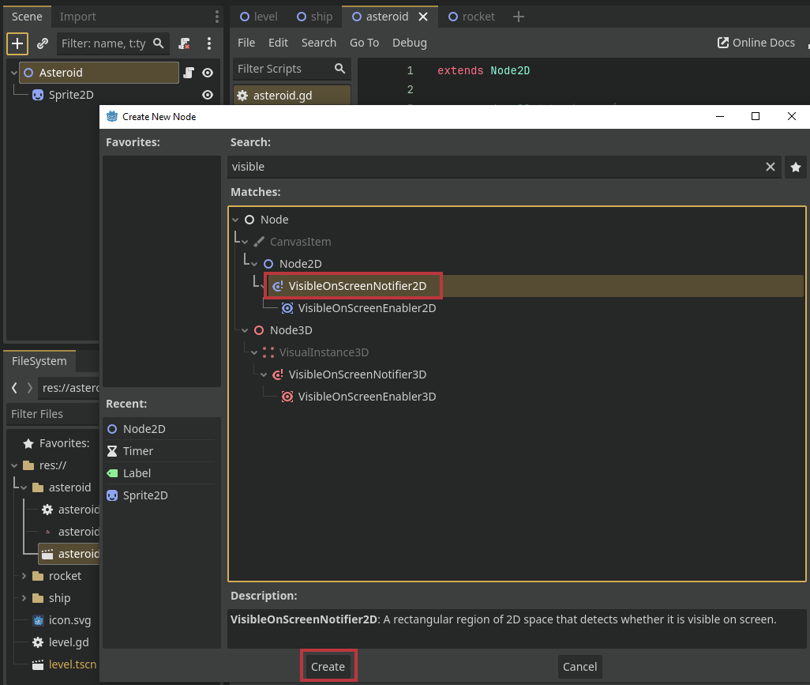

Kada _VisibleOnScreenNotifier2D_ prestane izađe van ekrana može obavestiti neki objekat o tome proko mehanizma _signal_-a. Signal je poesban objekat koji je kao i metode i svojstva deo objekta, u našem slučaju deo _VisibleOnScreenNotifier2D_ čvora, i koji može pozvati sve funkcije koje su se prijavile na taj signal. Prijavljivanje na signal možemo odraditi preko skripte, ali takođe to možemo definisati i u samoj sceni. Sa desne strane imamo tab _Node_ gde se nalazi lista signala koje izabrani čvor poseduje. Nas zanima signal `screen_exited` koga naš novi čvor ima, i koga će on automatski okinuti kada detektuje da je izašao van ekrana. Na sledeći način u trenutnoj sceni možemo povezati ovaj signal i funkciju koja se treba pozvati u _asteroid_ skripti:

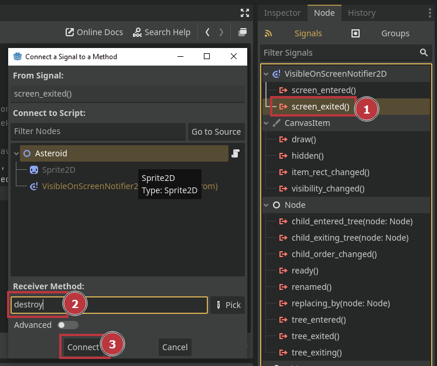

Ova `destroy` funkcija će automatski biti dodata u skriptu _Asteroid_ čvora koji smo izabrali, a kako bi odradila odgovarajuć posao, tj. uništila asteroid, doradićemo funkciju na sledeći način:

```gdscript
func destroy():
	queue_free() # iniciranje brisanja ovog objekta
```

## Upravljanje brodom

Na isti način kako smo kreirali skriptu za asteroid kreiraćemo i skriptu za brod. Nazvaćemo je `ship.gd`, smestiti u `ship` folder i zakačiti na _root_ čvor broda u sceni _ship_. Sledeći kod će nam omogućiti kontrolu broda:

```gdscript
class_name Ship
extends Node2D

# učitaćemo informacije iz scene kao objekat, i kasnije ga možemo pretvoriti u Node i instancirati
var rocket_scene = preload("res://rocket/rocket.tscn")
var speed = 150

# funkcija vraća smer kretanja po x osi u zavisnosti od inputa igrača
# ukoliko su pritisnuti dugmići i za levo i za desno kretanje će se anulirati
func calc_direction():
	var dir = Vector2.ZERO
	dir.x += 1 if Input.is_action_pressed("ui_right") else 0
	dir.x += -1 if Input.is_action_pressed("ui_left") else 0
	return dir

func fire():
	# od objekta koji predstavlja rocket scenu kreiramo stablo čvorova ...
	# ... sa root čvorom kao nosiocem cele te strukture
	# u promenljivoj rocket čuvamo referencu na novokreirani root čvor tog stabla
	var rocket = rocket_scene.instantiate()
	rocket.position = position + Vector2(0, -20) # postavljamo početnu poziciju rakete malo iznad broda
	add_sibling(rocket)	# dodajemo raketu u igru, tj. u stablo gde se nalazi i brod tako da imaju isti parent čvor

func _process(delta):
	var direction = calc_direction() # dobijamo smer kretanja u zavisnosti od inputa igrača
	translate(direction * speed * delta) # pomeramo brod u željenom smeru
	
# ova ugrađena funkcija se poziva svaki put kada igrač pritisne bilo koje dugme
func _unhandled_input(event):
	if event.is_action_pressed("ui_accept"): # ukoliko je pritisnuto dugme zapravo space ili enter ...
		fire()	# ... ispaljujemo raketu

```

Za sada se raketa ne pomera, samo se pojavi u igri iznad broda. Zato ćemo kreirati skriptu za raketu i na isti način kako konstantno pomeramo asteroid na dole tako ćemo i raketu na gore:

```gdscript
class_name Rocket
extends Node2D

var speed = 250

func _process(delta):
	var direction = Vector2(0, -1)
	translate(direction * speed * delta)
```

## Kolizije

Sledeća bitna funkcionalnost svakog od glavnih elemenata igre je detakcija kolozije. U našem slučaju treba da detektujemo samo dva slučaja:
- Kolizija između asteroida i rakete
- Kolizija između asteroida i broda

Kao i sve ostalo, ovaj deo možemo realizovati na više načina. Sobzirom da je u oba slučaja kolizije _asteroid_ učesnik kod koji se kolizija tiče možemo smestiti u skriptu asteroida. Ali, da bismo uopšte mogli da detektujemo koliziije potrebno je da dodamo par čvorova u scene ovih objekata.

Počećemo od asteroida. Dodaćemo _Area2D_ čvor koji može okinuti određeni signal kada detektuje koliziju sa drugim čvorovima koji služe za istu detekciju. Ovom čvoru je za funkcionisanje potreban _child_ node koji definiše oblik za koliziju sa drugim oblicima, te ćemo dodati ugnježden _CollisionShape2D_ čvor:

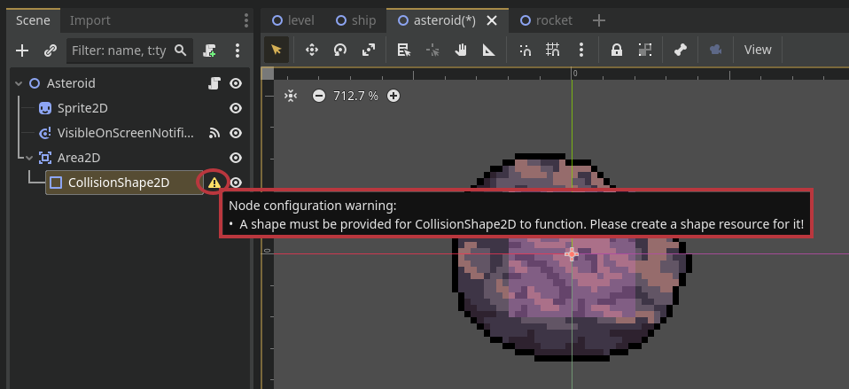

Možemo videti obaveštenje da je ovom čvoru potreno definisati konkretan oblik kako bi mogao da funkcioniše i služi svom _parent_ _Area2D_ čvoru. Informacije o tom obliku, tj. resurs, možemo ugraditi direktno u sam fajl scene, bez potrebe da ga definišemo kao poseban resurs fajl u fajlovima projekta:

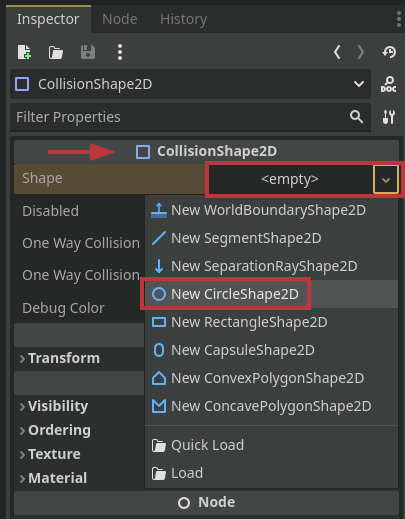

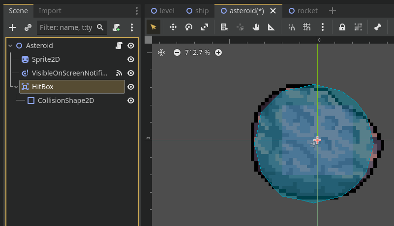

Isto ovo ćemo odraditi za raketu i brod:

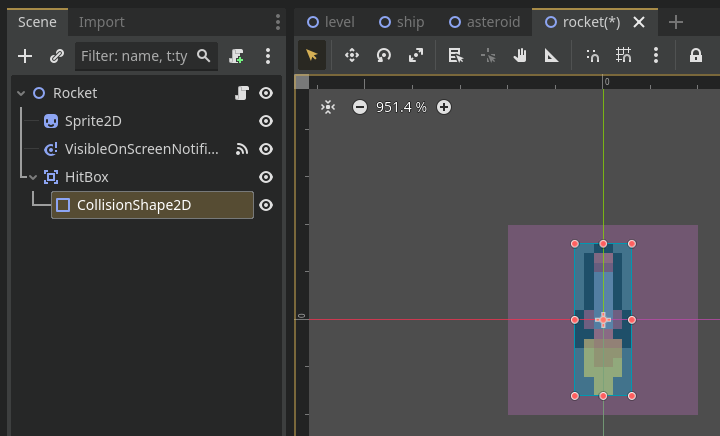

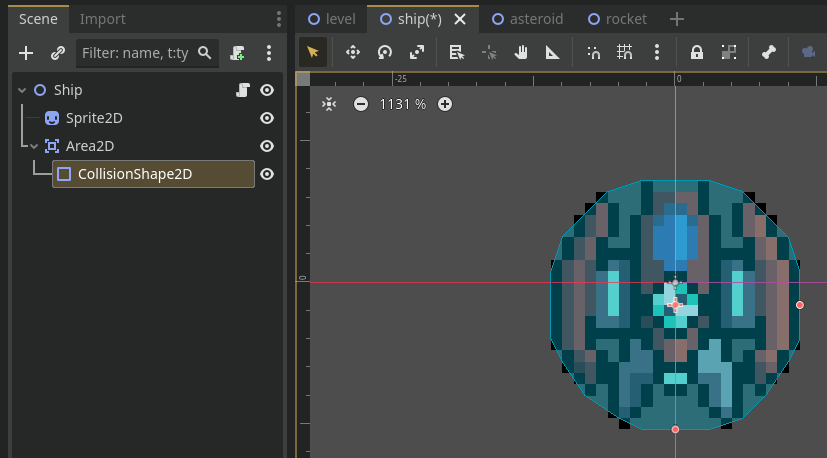

### Kod za detekciju kolizije

Kako bismo izvršili kod u asteroid objektu koji reaguje na kolizije potrebno je da povežemo funkciju iz asteroida sa signalom njegovog _Area2D_ kolajdera. Funkciju ćemo nazvati `on_collision` i povezati je sa signalom `area_entered`:

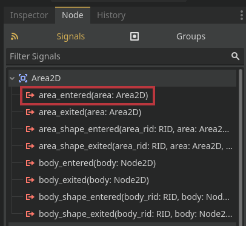

Funkcija treba da primi jedan parametar koji će joj signal poslati, i to tipa _Area2D_, koj predstavlja referencu na neki drugi kolajder ovog tipa sa kojim se kolajder koji je okinuo signal preklopio. Pored ove funkcije u skriptu asteroida ćemo dodati i sopstveni signal koji ćemo okinuti kada raketa uništi asteroid pa igrač treba da dobije poen:

```gdscript
signal point_gained # okida se kada je potrebno da igrač dobije poen zbog uništenja asteroida

signal point_gained # okida se kada je potrebno da igrač dobije poen zbog uništenja asteroida
func on_collision(area: Area2D):
	var target = area.get_parent() # uzimamo vlasnika HitBox-a sa kojm se asteroid sudario
	# ukoliko raketa pogodila asteroid treba unistiti oba objekta i emitovati signal
	if target is Rocket:
		target.destroy()
		destroy()
		point_gained.emit()
	# ukoliko je asteroid udario brod onda ga treba unistiti
	elif target is Ship:
		target.destroy()
```

Vidimo da se ovde pozivaju `destory` funkcije objekata _Ship_ i _Rocket_, ali njih još uvek nismo definisali. Za raketu je jednostavno, biće isot kao i za asteroid:

```gdscript
func destroy():
	queue_free()
```

Za brod ćemo pored ovog brisanja okinuti i signal koji ćemo dakođe definisati u _ship_ skripti:

```gdscript
signal destroyed

func destroy():
	destroyed.emit()
	queue_free()
```

Ovaj signal nam je potreban kako bismo javili _level_ čvoru da treba da prekine igru i omogući nam da je pokrenemo ponovo.

## Level skripta

Pored upravljanja početkom i završetkom igre, _level_ čvor će biti zadužen i za stvaranje novih asteroida koji će padati ka igraču i biti uništeni na dnu prozora, kao i za praćenje ostvarenih poena igrača.

### Asteroid Spawner

Prvo ćemo kreirati _level_ skriptu i zakačiti je na _root_ čvor _level_ scene. Rakođe u istu scenu ćemo dodati _Timer_ _Node_ koji će služiti da na određen fiksan vremenski interval okine signal koji će pozvati odgovarajuću metodu za stvaranje novog asteroida. Na taj način možemo konstantno dobijati nove asteroide u igri koji će dalje obavljati svoja zaduženja.

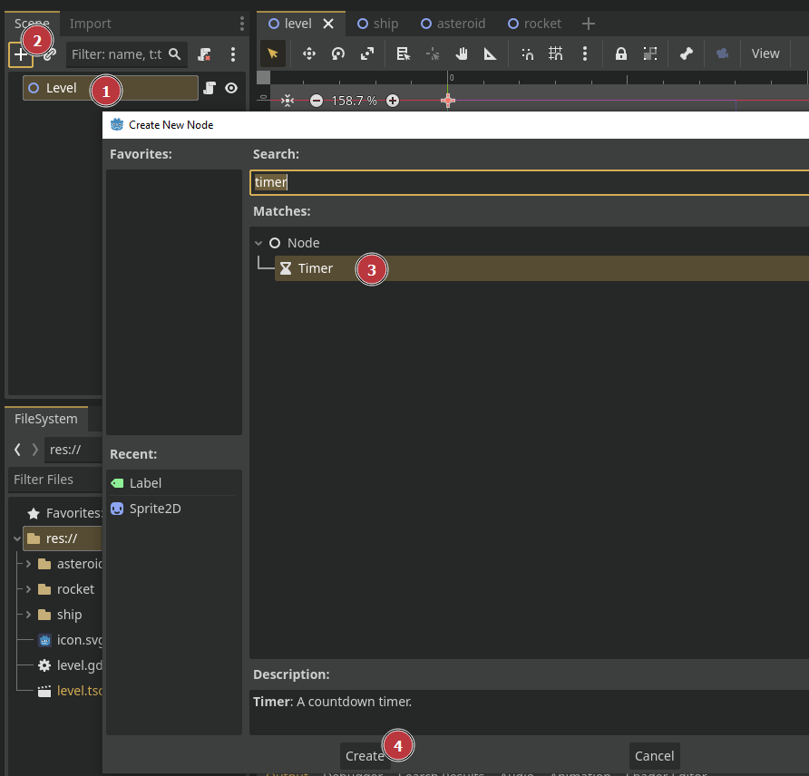

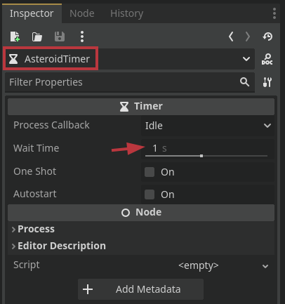

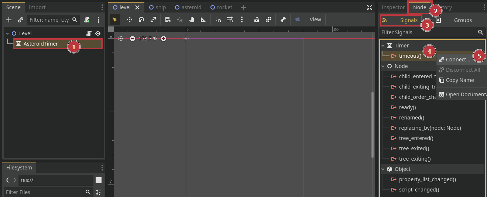

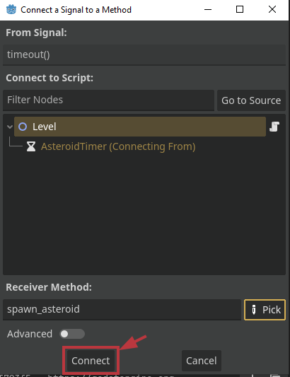

Slično kao i za ispaljivanje raketa, logiku za stvaranje novih asteroida možemo kreirati na sledeći način:

```gdscript
extends Node2D

var asteroid_scene = preload("res://asteroid/asteroid.tscn")

func start():
	# start asteroid spawn timer
	$AsteroidTimer.start()
	
func end():
	started = false
	$AsteroidTimer.stop() # zaustavljamo tajmer za kreiranje asteroida
	$StartLabel.visible = true # prikazujemo start label

func spawn_asteroid():
	var asteroid = asteroid_scene.instantiate()
    # nasumična pozicija na x osi odvojena od ivica minimum 20px
	asteroid.position = Vector2(randi() % 160 + 20, -20)
	asteroid.point_gained.connect(add_score)
	add_child(asteroid)
```

### Game Loop

Sada, kako bismo realizovali upravljanje početkom i završetkom igre, potrebno je da se povežemo signal `destroyed` iz _ship_ čvora. Takođe, kada igra počne, treba da instanciramo brod, jer će na završetku igre biti uništen:

```gdscript
var ship_scene = preload("res://ship/ship.tscn")
var started = false

func start():
	started = true
	# kreiramo brod, postavljamo ga na pocetnu poziciju i povezujemo signal
	var ship = ship_scene.instantiate()
	ship.position = Vector2(100, 270)
	ship.destroyed.connect(end)
	add_child(ship)
	# start asteroid spawn timer
	$AsteroidTimer.start()
	
func end():
	started = false
	$AsteroidTimer.stop() # zaustavljamo tajmer za kreiranje asteroida

func spawn_asteroid():
	var asteroid = asteroid_scene.instantiate()
    asteroid.point_gained.connect(add_score)
	# nasumična pozicija na x osi odvojena od ivica minimum 20px
	asteroid.position = Vector2(randi() % 160 + 20, -20) 
	add_child(asteroid)

func _unhandled_input(event):
	if not started and Input.is_action_pressed("ui_accept"):
		start()
```

### Score, UI i završne dorade

Ostalo je još da realizujemo praćenje poena i njihovo prikazivanje na ekranu, kao i prikazivanje teksta koji nam govori kako da pokrenemo igru. Takođe dodaćemo i igre koja izgleda kao svemir.

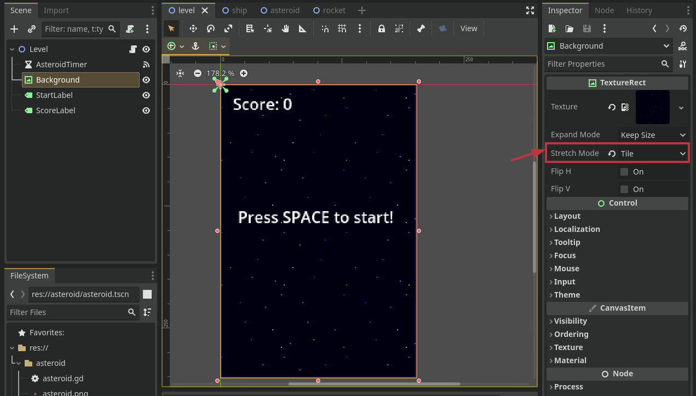

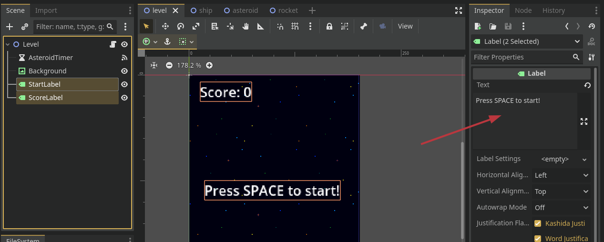

Poene povećavamo kada uhvatimo signal asteroida koji govori da ga je uništila raketa, tj. signal `point_gained` iz _asteroid_ čvora. Kako bismo promenili tekst u _Label_ čvoru koji smo nazvali _ScoreLabel_ potrebno je da mu pristupimo iz skripte. Pomoću znaka `$` možemo pristupiti _child_ čvorovima nekog _Node_-a po samom imenu čvora. Sledećim izmenama _label.gd_ skripte dodajemo ove funkcionalnosti:

```gdscript
extends Node2D

var asteroid_scene = preload("res://asteroid/asteroid.tscn")
var ship_scene = preload("res://ship/ship.tscn")
var score = 0 # <<<===========
var started = false

func start():
	started = true
	# resetujemo score na 0
	set_score(0) # <<<===========
	# sakrivamo start label
	$StartLabel.visible = false # <<<===========
	# kreiramo brod, postavljamo ga na pocetnu poziciju i povezujemo signal
	var ship = ship_scene.instantiate()
	ship.position = Vector2(100, 270)
	ship.destroyed.connect(end) # <<<===========
	add_child(ship)
	# start asteroid spawn timer
	$AsteroidTimer.start()
	
func end():
	started = false
	$AsteroidTimer.stop() # zaustavljamo tajmer za kreiranje asteroida
	$StartLabel.visible = true # prikazujemo start label # <<<===========
	
func add_score(): # <<<===========
	set_score(score + 1)
	
func set_score(value): # <<<===========
	score = value
	$ScoreLabel.text = "Score: " + str(score)

func spawn_asteroid():
	var asteroid = asteroid_scene.instantiate()
	asteroid.point_gained.connect(add_score) # <<<===========
	# nasumična pozicija na x osi odvojena od ivica minimum 20px
	asteroid.position = Vector2(randi() % 160 + 20, -20) 
	add_child(asteroid)
```

Ovim izmenama smo završili kreiranje jednostavne _Space Shooter_ igrice i stigli do kraja ovog kursa. Korisni linkovi ka materijalim za dalje učenje o _Godot_-u kao i materijali korišćeni u ovom projektu se nalaze u linkovima ispod.

## Linkovi

Slike korišćene na kursu su iz sledećih kolekcija:
- [foozlecc.itch.io/void-fleet-pack-1](https://foozlecc.itch.io/void-fleet-pack-1)
- [foozlecc.itch.io/void-environment-pack](https://foozlecc.itch.io/void-environment-pack)
- [foozlecc.itch.io/void-main-ship](https://foozlecc.itch.io/void-main-ship)
- [github.com/uheartbeast/Galaxy-Defiance](https://github.com/uheartbeast/Galaxy-Defiance)

Godot dokumentaijca:
- [Godot Docs](https://docs.godotengine.org)
- [Godot Docs: Best Practices](https://docs.godotengine.org/en/stable/tutorials/best_practices/)

YouTube kanali:
- [youtube.com/@uheartbeast](https://www.youtube.com/@uheartbeast)
- [youtube.com/@TheShaggyDev](https://www.youtube.com/@TheShaggyDev)
- [youtube.com/@mrelipteach](https://www.youtube.com/@mrelipteach)
- [youtube.com/@gamedevaki](https://www.youtube.com/@gamedevaki)
- [youtube.com/@Chaff_Games](https://www.youtube.com/@Chaff_Games)
- [youtube.com/@GameDevArtisan](https://www.youtube.com/@GameDevArtisan)
- [youtube.com/@godotneers](https://www.youtube.com/@godotneers)

Ostalo:
- [shaggydev.com](https://shaggydev.com)
- [Godot: Writting Clean Code (YouTube)](https://youtu.be/6QGCbGEvqyE?si=7i5c4tReZCP2PqLY)